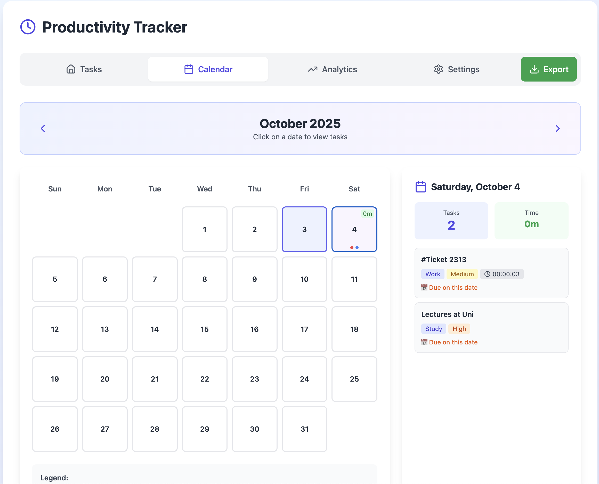
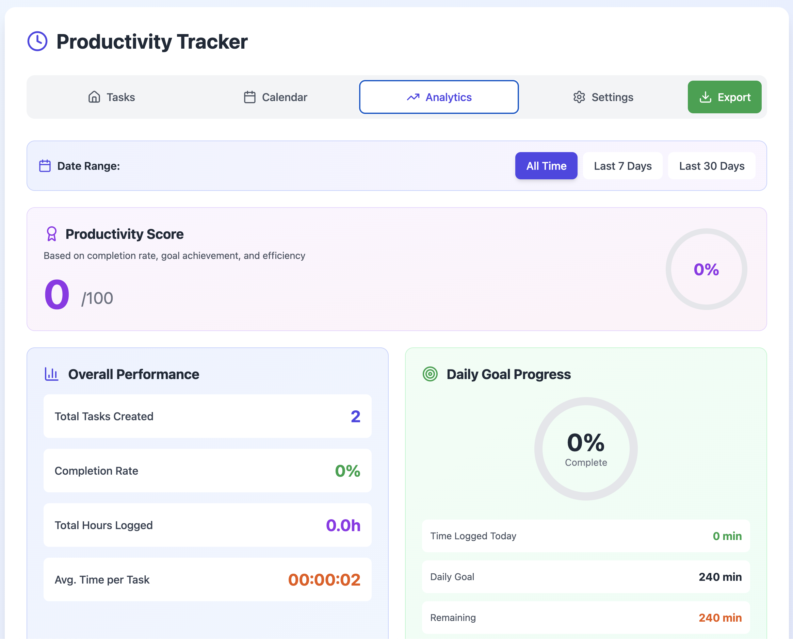

# 📌 Productivity Tracker

## 📝 Description

React + Tailwind web application for tracking tasks, time, and productivity.  
Users can create, edit, and categorize tasks, add notes, tags, and due dates, and track time spent on each task.  
The app provides interactive statistics, productivity scoring, daily goals, and calendar view.  
Data can be filtered, sorted, and exported in multiple formats (JSON, TXT, PDF).  
Settings allow theme customization and goal adjustments.

---

## 🚀 Features

- ✅ Create, edit, delete tasks
- ⏱️ Start, pause, reset task timers
- 🏷️ Tags, notes, and due dates
- 📊 Interactive statistics & productivity score
- 🎯 Daily goals with progress tracking
- 📅 Calendar view with deadlines
- 📥 Multi-step export (JSON, TXT, PDF)
- 🎨 Theme customization

---

## ⚙️ Tech Stack

- **Frontend:** React, Tailwind CSS
- **Charts & Visualization:** Recharts, Lucide Icons
- **Deployment:** Vercel

---

## 📂 Project Structure

```bash
src/
├── components/   # TaskCard, TaskForm, FilterBar, Stats, etc.
├── pages/        # TasksPage, AnalyticsPage, SettingsPage, CalendarPage
├── App.js        # Main app with routing
└── index.js      # Entry point
```

---

## 📦 Installation & Setup

```bash
# Clone repository
git clone https://github.com/your-username/productivity-tracker.git
cd productivity-tracker

# Install dependencies
npm install

# Run development server
npm start
```

---

## 📸 Screenshots






---

## 👨‍💻 Author

Developed by Aleksa Cvijic
